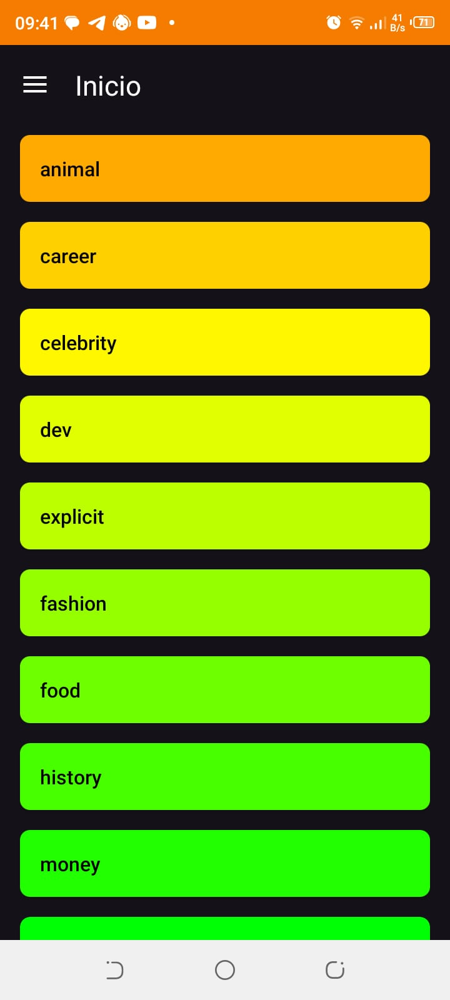
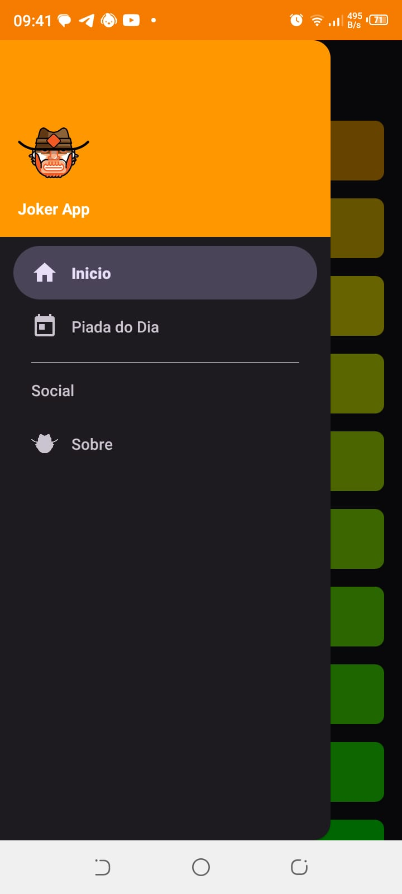
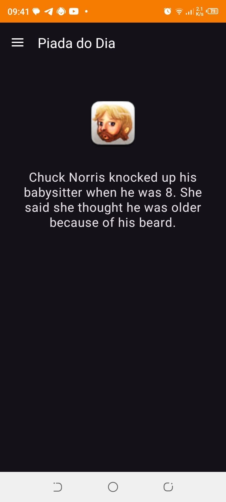
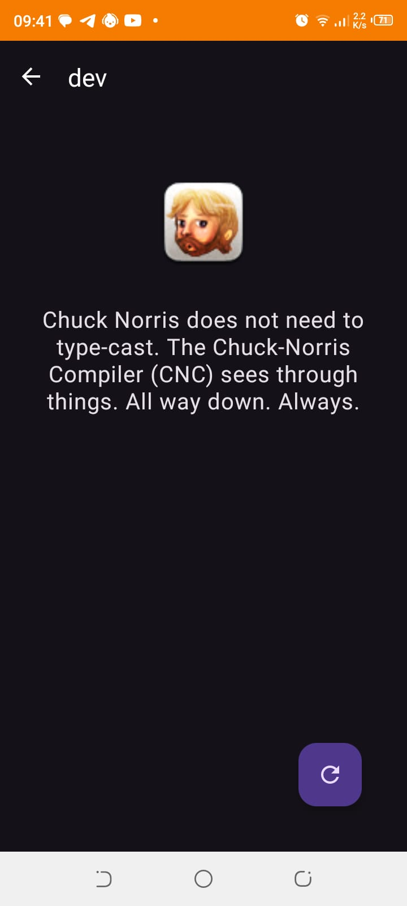
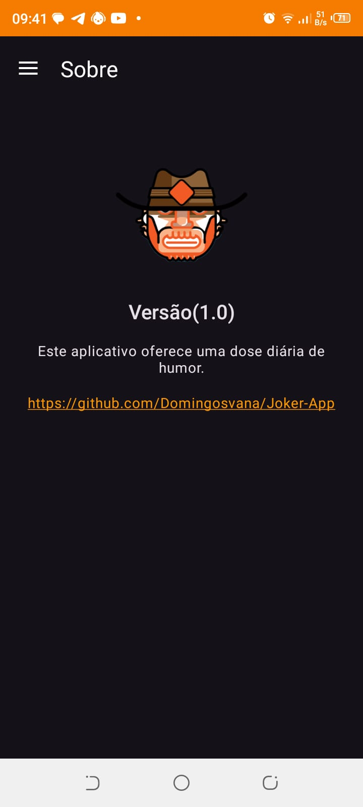
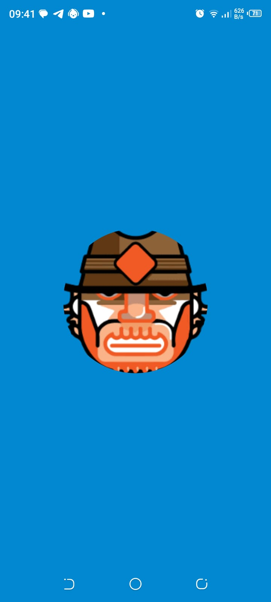
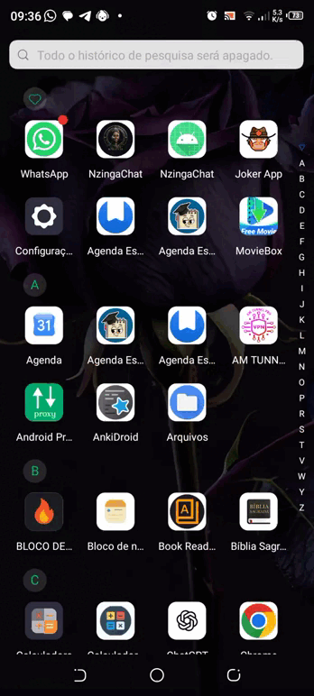

# Joker App 🃏

Um aplicativo Android moderno para quem precisa de uma dose diária de humor com as melhores piadas do Chuck Norris.

## 📸 Capturas de Tela

  
  
  

  
  
  

## 🎥 Demonstração

  

## 🚀 Funcionalidades

- **Categorias de Piadas:** Navegue por diversas categorias e encontre piadas específicas.
- **Piada do Dia:** Receba uma piada aleatória para alegrar o seu dia.
- **Modo Escuro (Dark Mode):** Interface moderna e confortável para os olhos.
- **Navegação Intuitiva:** Menu lateral (Drawer) para acesso rápido a todas as seções.
- **Sobre:** Informações do projeto e link para o código-fonte.

## 🛠 Tecnologias Utilizadas

- **Linguagem:** Kotlin
- **Arquitetura:** MVVM (Model-View-ViewModel)
- **Networking:** Retrofit & OkHttp para consumo da API Chuck Norris.
- **UI:** Material Design 3, Navigation Component, ConstraintLayout.
- **Imagens:** Picasso para carregamento de imagens.
- **Listas Dinâmicas:** Groupie para facilitar a criação de layouts complexos em RecyclerViews.
- **Splash Screen:** API oficial do Android para telas de carregamento.

## 📄 Especificação

Para detalhes técnicos e requisitos do projeto, consulte o arquivo local `docs/spec/specification.md` (não disponível no repositório remoto).

## 🔗 Link do Projeto
[GitHub - Domingosvana/Joker-App](https://github.com/Domingosvana/Joker-App)
